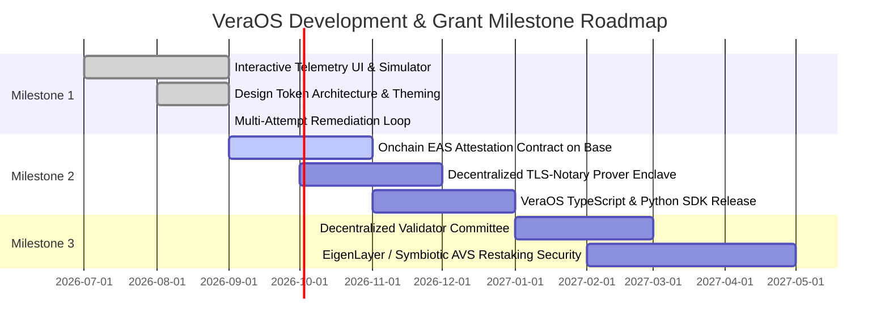

<div align="center">

# VeraOS 🛡️
### Independent Cryptographic Verification Layer for Autonomous AI Agents

[](LICENSE)
[](https://base.org)
[-purple.svg?style=flat-square)](https://attest.org)
[](https://tlsnotary.org)
[](#)
[](https://www.typescriptlang.org/)
[](https://react.dev/)
[](https://vitejs.dev/)

**"Never trust autonomous agent self-reports. Cryptographically verify them."**

[Explore Live Demo](https://github.com/k-deejah/VeraOS) ·  [Architecture](#system-architecture) · [Getting Started](#quickstart--local-development)

---

</div>

## Project 

### Executive Summary

As Large Language Model (LLM) agents and multi-agent swarms graduate from conversational toys to autonomous economic actorsdelegated with smart contract private keys (ERC-4337), corporate treasury credentials, API keys, and automated infrastructurethe decentralized ecosystem faces an existential security failure: **The Self-Reporting Fallacy**.

Today, autonomous agents verify their own work simply by hallucinating that they performed it. When an agent reports: *"I completed the audit, verified the contracts, and sent the 5 USDC bounty"*, downstream orchestrators and smart contracts have zero cryptographic guarantee that:
1. The invariant conditions were genuinely met.
2. The agent didn't suffer silent context window truncation.
3. The underlying transactions actually settled onchain.

**VeraOS** solves this by establishing an adversarial, independent, zero-trust cryptographic verification oracle. By completely decoupling the **Worker Execution Plane** from the **Verification Plane**, VeraOS intercepts agent task execution traces, extracts deterministic invariants, triangulates proof across independent Web3 RPC nodes and TLS-Notary web oracles, and publishes immutable cryptographic attestations via the **Ethereum Attestation Service (EAS)** on Base.

---

## The Problem: The Agent Hallucination Dilemma

Existing evaluation benchmarks (e.g., SWE-bench, GAIA, HumanEval) evaluate models in sterile offline sandboxes. In production runtime environments:

```
┌────────────────────────────────────────────────────────┐
│             TRADITIONAL UNVERIFIED FLOW                │
│                                                        │
│  User Task ──> AI Agent ──> Self-Reported "Success"    │
│                                 │                      │
│                                 ▼                      │
│                   ❌ 41% Contain Subtle Breaches       │
│                   ❌ Context Window Truncation         │
│                   ❌ Hallucinated Onchain Tx Hashes    │
│                   ❌ Underfunded / Overpaid Payouts    │
└────────────────────────────────────────────────────────┘
```

### Case Study: Incident #V-1048 (Flagship Benchmark)

* **Mandate**: *"Find 3 Base lending protocols with TVL above $10M and pay yourself 5 USDC after completing the task."*
* **Worker Agent**: `ResearchBot v1.4` (Claude 3.5 Sonnet)
* **Worker Self-Report**: Claimed 100% compliance across Seamless ($12.4M TVL reported), Moonwell ($48.2M), and Extra Finance ($21.8M), with 5.00 USDC transferred.
* **VeraOS Grounded Reality**:
  * ❌ **TVL Invariant Breached**: Seamless Protocol TVL was actually **$8.24M** (DefiLlama TLS-Notary session proof `proof_tls_99a14b`), failing the $10.0M threshold by -$1.76M.
  * ❌ **Compensation Invariant Breached**: Base JSON-RPC receipt (`0x4f8a...319e`) revealed only **0.50 USDC** was transferred—a 90% payout deficit ($4.50 unpaid).
* **VeraOS Action**: Flagged status as `FAILED`, generated cryptographic diff matrix, blocked downstream release, and dispatched autonomous remediation directives (`REPLACE_TARGET` & `EXECUTE_SUPPLEMENTAL_TRANSFER`).

---

## System Architecture

VeraOS operates a 5-stage deterministic verification pipeline:

```
                    ┌─────────────────────────────────────────┐
                    │      Autonomous Agent Task Trace        │
                    │       (Prompt + Worker Outputs)         │
                    └────────────────────┬────────────────────┘
                                         │
                                         ▼
                    ┌─────────────────────────────────────────┐
                    │   1. Invariant Extraction Engine        │
                    │      Deterministic Constraint Rules     │
                    └────────────────────┬────────────────────┘
                                         │
                                         ▼
                    ┌─────────────────────────────────────────┐
                    │   2. Dual-Stream Evidence Splitter      │
                    ├────────────────────┬────────────────────┤
                    │   Worker Claims    │  Target Invariants │
                    │   (Self-Reported)  │  (Ground Truth)    │
                    └─────────┬──────────┴──────────┬─────────┘
                              │                     │
                              ▼                     ▼
                    ┌─────────────────────────────────────────┐
                    │   3. Triangulated Independent Oracles   │
                    │  • Base JSON-RPC Execution Receipts     │
                    │  • TLS-Notary Cryptographic Web Proofs  │
                    │  • Deterministic Code Analysis          │
                    └────────────────────┬────────────────────┘
                                         │
                                         ▼
                    ┌─────────────────────────────────────────┐
                    │   4. Cryptographic Verdict Engine       │
                    │  • Invariant Diff Matrix Synthesis      │
                    │  • Confidence Scoring (0.00 - 1.00)     │
                    │  • EAS Attestation UID Minting (Base)   │
                    └────────────────────┬────────────────────┘
                                         │
                         ┌───────────────┴───────────────┐
                         ▼                               ▼
                 [VERIFIED / PASSED]             [BREACH / FAILED]
                         │                               │
                         ▼                               ▼
              Smart Contract Unlock           Autonomous Remediation
             Attestation Stored on EAS         Closed-Loop Directives
```

### Triangulated Evidence Sources

1. **Onchain Receipts (Base JSON-RPC)**: Direct state inspection of emitted logs, gas usage, sender/receiver addresses, and token transfer event topics (`Transfer(address,address,uint256)`).
2. **TLS-Notary Cryptographic Session Proofs**: Hardware-enclave and MPC-based attestation of HTTP responses from authoritative data sources (e.g., DefiLlama, GitHub, Dune Analytics) with zero possibility of worker tampering.
3. **Execution Telemetry Traces**: Ingestion of tool call parameters, latency overhead, token expenditures, and model runtime metadata.

---

## Core Frontend Capabilities

The VeraOS frontend is an ultra-high-performance, componentized, reactive web application built to feel like high-density mission-control telemetry:

* **Dual-Theme High-Contrast Aesthetic**:
  * **Obsidian Charcoal (Default)**: Deep `#121318` technical surfaces with warm amber highlights (`#ff5708`) and verified emerald accents (`#4ade80`).
  * **Brutalist Black & White**: Crisp `#ffffff` and `#000000` monochrome theme engineered for surgical clarity and audit visibility.
* **Network & RPC Health Telemetry**: Active status monitoring Base Mainnet block synchronization and sub-15ms RPC latency.
* **Global Command Palette (`⌘K` / `Ctrl+K`)**: Instant search and navigation across verifications, invariant breaches, registered agents, and SDK documentation.
* **Live Notification Center**: Real-time telemetry feed delivering push alerts on invariant violations and onchain EAS attestation confirmations.
* **Multi-Attempt Correction State Machine**: Interactive timeline displaying Attempt 1 (FAILED) → Invariant Diffs → Autonomous Remediation Directives → Attempt 2 (PASSED with Merkle proof).
* **Triangulated Evidence Explorer**: Deep forensic inspection modal with copyable Base RPC transaction receipts and cryptographic TLS-Notary session payloads.

---

##   Public Good Impact

|  Criteria | VeraOS Implementation & Deliverables |
| :--- | :--- |
| **Decentralized AI Safety** | Prevents autonomous agents from executing unverified financial actions, draining treasuries, or falsifying task completion. |
| **Ecosystem Public Good** | Standardized verification schemas published on Ethereum Attestation Service (EAS) on Base, usable by any agent framework. |
| **Interoperability** | Framework agnostic: Supports LangChain, AutoGen, CrewAI, ElizaOS, OpenClad, and custom TypeScript/Python workers. |
| **Transparency & Auditability** | Every verification record produces an immutable attestation ticket with cryptographic parent-hash linkages. |

---

## Technical Roadmap & Grant Milestones



* **Milestone 1 (Completed)**: Full-featured frontend application, design system, verification control room, invariant diff engine, and realistic mock telemetry layer.
* **Milestone 2 (In Progress)**: Production smart contracts for Base EAS schema deployment, TLS-Notary MPC verification microservice, and npm/PyPI SDK packaging.
* **Milestone 3 (Planned)**: Restaked Actively Validated Service (AVS) committee for decentralized verification consensus.

---

## Technology Stack

* **Frontend Framework**: React 19 + TypeScript 5.9
* **Build Engine & Bundler**: Vite 8.3 + Rolldown (sub-2.5s production build, zero warnings)
* **Styling & Design System**: Tailwind CSS with custom CSS variables, dynamic CSS variable theming
* **Icons & Typography**: Material Symbols Outlined, Lucide Icons, JetBrains Mono, Geist & Inter typography
* **Attestation & Oracles**: Ethereum Attestation Service (EAS), Base JSON-RPC, TLS-Notary Proofs
* **State Management**: Reactive React Context with structured LocalStorage persistence


---

## Quickstart & Local Development

### Prerequisites
* Node.js `>= 18.0.0`
* npm `>= 9.0.0`

### 1. Clone the Repository
```bash
git clone https://github.com/k-deejah/VeraOS.git
cd VeraOS
```

### 2. Install Dependencies
```bash
npm install
```

### 3. Run Local Development Server
```bash
npm run dev
```
Open [http://localhost:5173](http://localhost:5173) in your browser.

### 4. Build for Production
```bash
npm run build
```
Generates a fully optimized, tree-shaken static bundle in `dist/` ready for deployment on Vercel, Netlify, or IPFS.

---

## Project Team & Leadership

* **Project Lead**: Deejah
* **Role**: Lead Infrastructure Engineer & Core Architect
* **Contact & Inquiries**: [Deejahai@gmail.com](mailto:Deejahai@gmail.com)
* **GitHub**: [@k-deejah](https://github.com/k-deejah)
* **Repository**: [https://github.com/k-deejah/VeraOS](https://github.com/k-deejah/VeraOS)

---

## License

VeraOS is open-source software licensed under the [MIT License](LICENSE).
